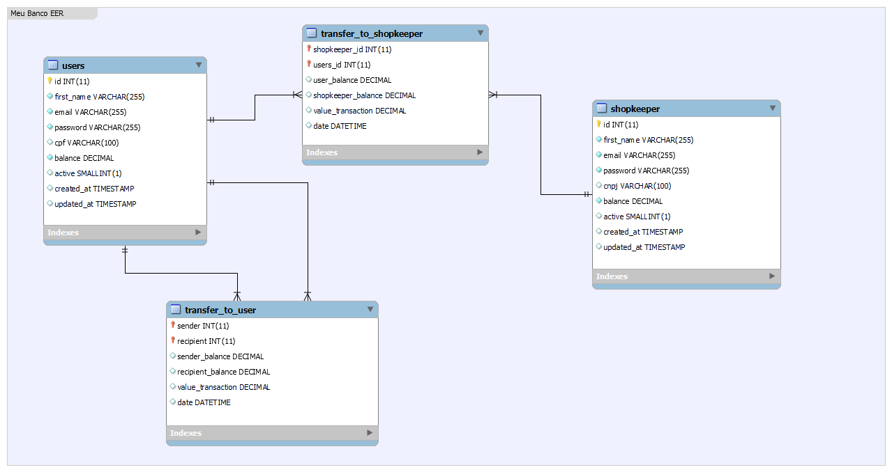

# Meu Banco

REST API que simula transações de entre usuários de um banco digital.

## Tecnologias
- Laravel - 9.0
- PHP - 8.1.5
- MYSQL
- Redis
- Queue Laravel

## Diagrama de ER



## ApiDoc

Para consultar a documentação da API [clique aqui](https://htmlpreview.github.io/?https://github.com/MatheusMeloAntiquera/meu-banco/blob/master/apidoc/index.html)

Para atualizar a documentação use o comando:

```shell
apidoc -i ./api/app/Http/Controllers/ -o ./apidoc
``` 

## Para desenvolver

Para iniciar a aplicação usando docker, primeiro entre na pasta `api`:
```
cd ./api
```
Depois rode o comando para instalar os pacotes do compose:
```
compose install
```
Depois rode o comando:
```
docker-composer up -d
```

## Para Testar
entre na pasta `api`e rode o comando:
```
php artisan test --env=testing
```
ou: 
```
./vendor/bin/phpunit
```
